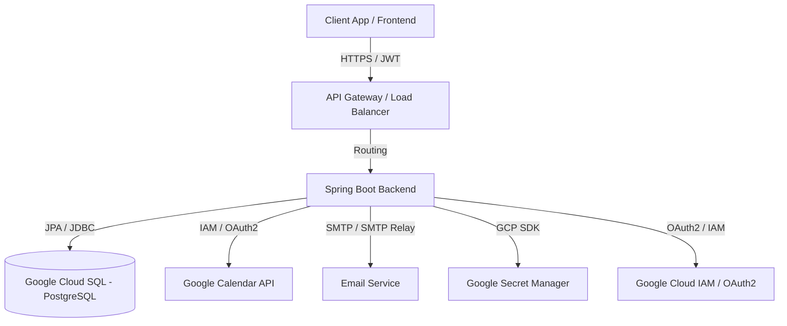
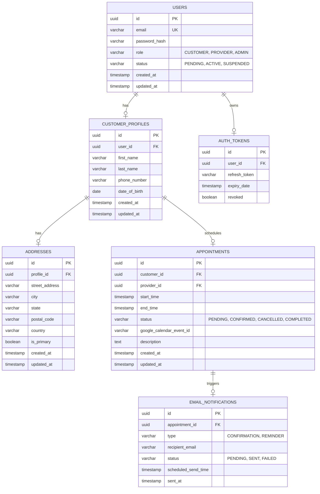
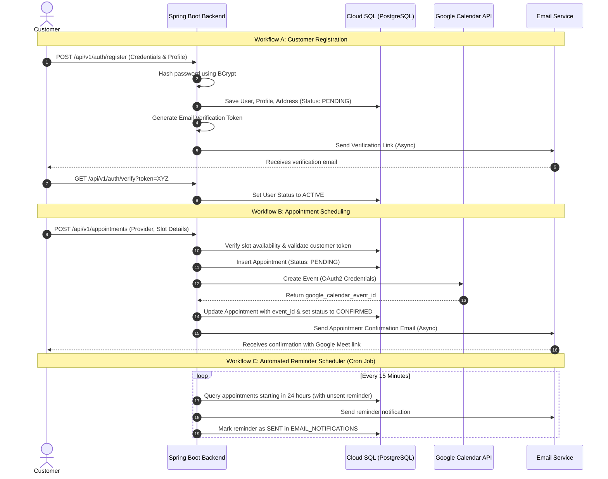

# Technical Design & Architecture Blueprint for Vaidhyashala

This document presents a comprehensive technical design, architecture overview, data models, folder structures, and API specifications for Vaidhyashala's secure customer management and appointment scheduling system. It utilizes Google Cloud Platform (GCP) services, Google Calendar API, and Spring Boot.

---

## 1. Executive Summary & Design Approach

Vaidhyashala requires an enterprise-ready, scalable, and secure backend that handles user registration, customer profiles, address management, appointment scheduling, Google Calendar synchronization, and automated notification services. 

To achieve this, we adopt a **Layered Architecture (N-Tier)** using **Spring Boot 3.x / Java 17**, integrating with relational storage, cloud security services, and third-party APIs. We recommend deploying on **Google Cloud Platform (GCP)** using **Google Cloud SQL (PostgreSQL)** for transactional persistence, **Google Secret Manager** for credential safety, and **Google Calendar REST API** for schedule synchronization.



---

## 2. Customer Management & Relational Database Design

### Recommended GCP Data Repository
We recommend **Google Cloud SQL for PostgreSQL**.
- **Reasoning**: The data is highly structured and relational (Users have Profiles, which have Addresses and Appointments). PostgreSQL offers full ACID compliance, advanced querying capabilities, and native integration with Hibernate/JPA (via `spring-boot-starter-data-jpa`).
- **Security & Scalability**: Cloud SQL supports automatic encryption-at-rest, Customer-Managed Encryption Keys (CMEK), IAM database authentication (removing the need for static password configuration), and high-availability (HA) regional failover.

### Entity-Relationship Diagram (ERD)



---

## 3. Google Cloud Integration & Credential Management

### Secure Communication & Authorization
1. **Workload Identity Federation / IAM Service Accounts**:
   - In production (e.g., GKE or Cloud Run), we avoid storing static JSON keys inside the container. We use GCP Workload Identity to bind the Kubernetes/Cloud Run service account to a GCP IAM Service Account with minimal permissions.
   - For local development, authentication is managed via the `GOOGLE_APPLICATION_CREDENTIALS` environment variable pointing to a local service account key.
2. **Google Secret Manager**:
   - Store credentials such as database passwords, JWT signing keys, client secrets, and mail server credentials.
   - The Spring application resolves these dynamically at startup using the `spring-cloud-gcp-starter-secretmanager` library.

### Configuration Layout
```yaml
spring:
  cloud:
    gcp:
      project-id: vaidhyashala-prod
      secretmanager:
        enabled: true
  datasource:
    url: jdbc:postgresql:///${DB_SOCKET_FACTORY}/${DB_NAME}?socketFactory=com.google.cloud.sql.postgres.SocketFactory
    username: ${sm://db-username}
    password: ${sm://db-password}
    driver-class-name: org.postgresql.Driver
  mail:
    host: smtp.sendgrid.net
    port: 587
    username: apikey
    password: ${sm://smtp-api-key}
    properties:
      mail:
        smtp:
          auth: true
          starttls:
            enable: true

google:
  calendar:
    client-id: ${sm://google-calendar-client-id}
    client-secret: ${sm://google-calendar-client-secret}
    redirect-uri: https://api.vaidhyashala.com/api/v1/calendar/callback
```

---

## 4. Application Workflow Design



---

## 5. Backend Project Architecture

We utilize an N-Tier architecture to decouple logic, facilitate unit testing, and isolate concerns.

### Project Package Directory Structure

```text
Backend/
├── src/
│   ├── main/
│   │   ├── java/
│   │   │   └── com/
│   │   │       └── version1/
│   │   │           └── backend/
│   │   │               ├── BackendApplication.java
│   │   │               ├── config/            # Infrastructure & integration configurations
│   │   │               │   ├── GcpConfig.java
│   │   │               │   ├── GoogleCalendarConfig.java
│   │   │               │   ├── MailConfig.java
│   │   │               │   └── SecurityConfig.java
│   │   │               ├── controller/        # REST controllers (entrypoints, input validation)
│   │   │               │   ├── AuthController.java
│   │   │               │   ├── AppointmentController.java
│   │   │               │   ├── CustomerController.java
│   │   │               │   └── NotificationController.java
│   │   │               ├── service/           # Business logic interfaces & implementations
│   │   │               │   ├── AuthService.java
│   │   │               │   ├── AppointmentService.java
│   │   │               │   ├── CustomerService.java
│   │   │               │   ├── GoogleCalendarService.java
│   │   │               │   └── EmailService.java
│   │   │               ├── repository/        # Spring Data JPA Repositories
│   │   │               │   ├── UserRepository.java
│   │   │               │   ├── CustomerProfileRepository.java
│   │   │               │   ├── AddressRepository.java
│   │   │               │   ├── AppointmentRepository.java
│   │   │               │   └── EmailNotificationRepository.java
│   │   │               ├── pojo/              # JPA Database Entities
│   │   │               │   ├── User.java
│   │   │               │   ├── CustomerProfile.java
│   │   │               │   ├── Address.java
│   │   │               │   ├── Appointment.java
│   │   │               │   └── EmailNotification.java
│   │   │               ├── dto/               # Data Transfer Objects (Request/Response models)
│   │   │               │   ├── UserRegistrationDto.java
│   │   │               │   ├── LoginRequestDto.java
│   │   │               │   ├── TokenResponseDto.java
│   │   │               │   ├── AppointmentCreateDto.java
│   │   │               │   └── CustomerProfileDto.java
│   │   │               ├── security/          # Security-specific classes (JWT, UserDetails)
│   │   │               │   ├── JwtAuthenticationFilter.java
│   │   │               │   ├── JwtTokenProvider.java
│   │   │               │   ├── CustomUserDetailsService.java
│   │   │               │   └── UserPrincipal.java
│   │   │               └── exception/         # Exception handling components
│   │   │                   ├── CustomException.java
│   │   │                   ├── ResourceNotFoundException.java
│   │   │                   ├── InvalidSlotException.java
│   │   │                   └── GlobalExceptionHandler.java
│   │   └── resources/
│   │       ├── application.yml
│   │       └── templates/
│   │           ├── email-confirmation.html
│   │           └── email-reminder.html
```

### Layer Responsibilities

| Layer | Responsibility |
| :--- | :--- |
| **Controllers** | Handle incoming HTTP requests, enforce request validation (`@Valid`), map request bodies to DTOs, and delegate to Services. Keep thin, do not embed business logic. |
| **Services** | Implement transactional business rules, orchestrate repository queries, call external integrations (GCP, GCal, SMTP), and map between Entities and DTOs. |
| **Repositories** | Manage queries to the database using Spring Data JPA. Define custom repository queries (e.g. finding free slots, fetching pending notifications). |
| **Entities/POJOs** | Map directly to database schema tables using JPA annotations (`@Entity`, `@Table`, `@Id`, etc.). Use UUID keys for security obfuscation. |
| **DTOs** | Expose only the fields required by the frontend client. Decouples the API contract from the internal database schema to allow evolution without breaking APIs. |
| **Security Components**| Authenticate incoming calls via JWT, build `UserPrincipal`, configure access rules, and enforce Role-Based Access Control. |
| **Configuration Classes**| Setup beans for GCP clients, HTTP clients, Google Calendar API connection, Web Security, CORS settings, and Async thread execution pools. |
| **Exception Handling**| Catch exceptions thrown anywhere in the call stack and translate them to meaningful HTTP responses (JSON format) with correct HTTP Status Codes. |

---

## 6. Security Architecture & Threat Mitigation

### Authentication & Authorization (RBAC)
- **Authentication**: Stateful sessions are avoided. A stateless, time-limited **JWT (JSON Web Token)** is used.
- **Token Management**: 
  - Access Token: Short-lived (e.g. 15 minutes), signed with `HS512` or `RS256` keys rotated via Secret Manager.
  - Refresh Token: Long-lived (7 days), stored in the database as an encrypted hash. Evaluated during token renewal. Follows **Refresh Token Rotation (RTR)**: using a refresh token invalidates it and issues a new pair to combat token hijacking.
- **Authorization**: Role-Based Access Control (RBAC) is enforced at the method level using Spring Security's `@PreAuthorize("hasRole('ROLE_CUSTOMER') or hasRole('ROLE_ADMIN')")`.

### Data Protection (At Rest & In Transit)
- **Encryption in Transit**: Enforce HTTPS exclusively. Deny weak TLS versions, enabling only TLS 1.2 and TLS 1.3. Set secure cookie parameters (`Secure`, `HttpOnly`, `SameSite=Strict`) if session mapping is ever needed.
- **Encryption at Rest**: Fully automated by GCP Cloud SQL. 
- **Application Field-Level Encryption**: Sensitive personally identifiable information (PII) like phone numbers, address details, and date of birth can be encrypted at the JPA layer before hitting the database using Spring Cryptography APIs or Attribute Converters.

### OWASP & Cloud Security Safeguards
- **SQL Injection**: Prevented by Hibernate ORM which uses SQL parameter binding by default. All dynamic queries are built using JPA Criteria API or parameters.
- **Cross-Site Scripting (XSS)**: Input parameters are sanitized using standard libraries. Output formats are forced to JSON (`application/json`), neutralizing HTML-context XSS.
- **CSRF**: Disabled since JWT tokens are client-managed in standard authorization headers (rather than web cookies). If cookies are preferred, Spring Security's CSRF token filter must be enabled.
- **Brute Force & DDoS Mitigation**: Expose API endpoints behind a rate limiter (e.g. Spring Cloud Gateway with Redis-backed Rate Limiter, GCP Cloud Armor, or a Bucket4j filter inside the backend).
- **Password Protection**: Salting and hashing passwords via **BCryptPasswordEncoder** with a cost factor of 12. Plain passwords are never stored or logged.

---

## 7. REST API Design (v1)

### 7.1 Authentication Endpoints

#### `POST /api/v1/auth/register`
Creates a new customer account.
- **Request Body**:
  ```json
  {
    "email": "customer@email.com",
    "password": "SecurePassword123!",
    "profile": {
      "firstName": "John",
      "lastName": "Doe",
      "phoneNumber": "+1234567890",
      "dateOfBirth": "1990-05-15"
    },
    "address": {
      "streetAddress": "123 Main St",
      "city": "Springfield",
      "state": "IL",
      "postalCode": "62701",
      "country": "USA"
    }
  }
  ```
- **Response (201 Created)**:
  ```json
  {
    "userId": "9b1deb4d-3b7d-4bad-9bdd-2b0d7b3dcb6d",
    "email": "customer@email.com",
    "status": "PENDING",
    "message": "Registration successful. Please verify your email."
  }
  ```

#### `POST /api/v1/auth/login`
Authenticates a user and returns tokens.
- **Request Body**:
  ```json
  {
    "email": "customer@email.com",
    "password": "SecurePassword123!"
  }
  ```
- **Response (200 OK)**:
  ```json
  {
    "accessToken": "eyJhbGciOiJIUzUxMiJ9...",
    "refreshToken": "df8734fd-8743-421c...",
    "tokenType": "Bearer",
    "expiresIn": 900
  }
  ```

#### `POST /api/v1/auth/refresh`
Obtains a new access token using a valid refresh token.
- **Request Body**:
  ```json
  {
    "refreshToken": "df8734fd-8743-421c..."
  }
  ```
- **Response (200 OK)**:
  ```json
  {
    "accessToken": "eyJhbGciOiJIUzUxMiJ9...",
    "refreshToken": "a7b3cd21-f093-41bb...",
    "tokenType": "Bearer",
    "expiresIn": 900
  }
  ```

---

### 7.2 Appointment Scheduling Endpoints

#### `GET /api/v1/appointments/slots`
Retrieves available slots for a specific provider on a date.
- **Parameters**: `providerId` (UUID), `date` (YYYY-MM-DD)
- **Response (200 OK)**:
  ```json
  [
    {
      "startTime": "2026-06-30T10:00:00Z",
      "endTime": "2026-06-30T10:45:00Z"
    },
    {
      "startTime": "2026-06-30T11:00:00Z",
      "endTime": "2026-06-30T11:45:00Z"
    }
  ]
  ```

#### `POST /api/v1/appointments`
Book an appointment slot.
- **Authorization**: `Bearer <accessToken>` (Customer Role)
- **Request Body**:
  ```json
  {
    "providerId": "5f64b9b9-d2b3-4613-88bc-49520e5c9b6d",
    "startTime": "2026-06-30T10:00:00Z",
    "endTime": "2026-06-30T10:45:00Z",
    "description": "General consultation about wellness plan."
  }
  ```
- **Response (201 Created)**:
  ```json
  {
    "appointmentId": "f7d73bc2-10cf-46d5-a3d8-55d8d21c4b4a",
    "customerId": "8e14bc21-df8b-49ad-ae19-86ab4832fd90",
    "providerId": "5f64b9b9-d2b3-4613-88bc-49520e5c9b6d",
    "startTime": "2026-06-30T10:00:00Z",
    "endTime": "2026-06-30T10:45:00Z",
    "status": "CONFIRMED",
    "googleCalendarLink": "https://calendar.google.com/calendar/event?eid=XYZ",
    "meetLink": "https://meet.google.com/abc-defg-hij"
  }
  ```

#### `GET /api/v1/appointments/me`
Retrieves a list of appointments scheduled for the authenticated user.
- **Authorization**: `Bearer <accessToken>` (Customer or Provider Role)
- **Response (200 OK)**:
  ```json
  [
    {
      "appointmentId": "f7d73bc2-10cf-46d5-a3d8-55d8d21c4b4a",
      "providerName": "Dr. Sarah Smith",
      "startTime": "2026-06-30T10:00:00Z",
      "endTime": "2026-06-30T10:45:00Z",
      "status": "CONFIRMED"
    }
  ]
  ```

---

## 8. Open Questions & Review Required

> [!IMPORTANT]
> **Calendar Integration Context**: Are we integrating with Google Calendar on behalf of a single organization/provider (e.g. a hospital where all doctors reside on a single Google Workspace domain using a Service Account with Domain-Wide Delegation)? Or are we integrating with multiple independent providers who must individually sign in via Google OAuth2 to grant access to their calendars?
> - *Recommendation*: If single organization, use a Service Account. If multi-tenant/independent providers, use OAuth2 Authorization Code Flow to link provider calendars.

> [!WARNING]
> **Email Notifications & Limits**: Which email delivery service provider should we utilize? 
> - *Recommendation*: SendGrid or Mailgun integrated with Spring Mail is usually preferred for high-deliverability transactional email volumes.
